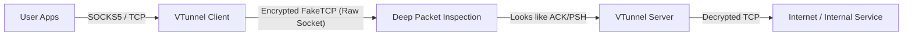

# VTunnel: High-Performance RawTCP/KCP Tunnel


-linux)


**VTunnel** is a lightweight, high-speed tunneling tool designed to bypass Deep Packet Inspection (DPI) and restrictive firewalls.

It works by encapsulating traffic into **FakeTCP** packets (using Raw Sockets) combined with **KCP** for reliability and **Smux** for multiplexing. It mimics legitimate TCP traffic patterns (ACK/PSH flags) to evade active probing and blocking mechanisms.

## 🚀 Features

- **Raw Socket & FakeTCP:** Bypasses OS network stack handshakes to confuse firewalls.
- **KCP Protocol:** Reliable UDP-based transport, optimized for high packet loss environments.
- **Dual Mode:** Supports **SOCKS5 Proxy** and **Port Forwarding** simultaneously over a single tunnel.
- **Multiplexing:** Handles thousands of concurrent connections using a single physical connection (Smux).
- **AES Encryption:** Secure communication with AES-GCM/CFB.
- **Auto-Management Script:** Includes a Bash script for easy installation, updates, and service management.
- **Cross-Platform:** Supports Linux `amd64` and `arm64`.

---

## 📦 Quick Installation (Recommended)

Install with one command (downloads and runs the installer script):

```bash
bash <(curl -Ls https://raw.githubusercontent.com/voono/vtunnel/refs/heads/main/install.sh)
```

Run with `sudo` if the script asks for root. Then follow the on-screen menu:

- **1** — Install dependencies and core binary
- **2** — Add a new Tunnel (Server or Client)

The script handles installation, `iptables` setup, and systemd service creation.


---

## ⚙️ Manual Installation & Usage

If you prefer running the binary manually without the script.

### 1. Build from Source

```bash
# Clone repo
git clone https://github.com/voono/vtunnel.git
cd vtunnel

# Build for Linux
env GOOS=linux GOARCH=amd64 go build -o vtunnel main.go

```

### 2. Kernel & Firewall Setup (Crucial)

Since VTunnel uses Raw Sockets, the OS Kernel might send `RST` packets because it doesn't recognize the connection. **You must block these RST packets.**

**On Server (Listening on port 443):**

```bash
sudo iptables -A OUTPUT -p tcp --tcp-flags RST RST --sport 443 -j DROP
sudo iptables -A INPUT -p tcp --dport 443 -j ACCEPT

```

**On Client:**

```bash
sudo iptables -A OUTPUT -p tcp --tcp-flags RST RST -j DROP

```

### 3. Running the Server (Outside Firewall)

```bash
# Run as Root
sudo ./vtunnel -mode server -port 443 -key "YourSecretKey"

```

### 4. Running the Client (Inside Firewall)

#### Scenario A: SOCKS5 Proxy

To use as a proxy for Telegram or Browser (e.g., `127.0.0.1:1080`):

```bash
sudo ./vtunnel -mode client -remote <SERVER_IP> -port 443 -listen :1080 -key "YourSecretKey"

```

#### Scenario B: Port Forwarding

To forward local port `8080` to a remote target (e.g., `1.1.1.1:80`) through the tunnel:

```bash
sudo ./vtunnel -mode client -remote <SERVER_IP> -port 443 -fwd "8080:1.1.1.1:80" -key "YourSecretKey"

```

#### Scenario C: Dual Mode (SOCKS5 + Forwarding)

```bash
sudo ./vtunnel -mode client \
  -remote <SERVER_IP> \
  -port 443 \
  -listen :1080 \
  -fwd "8080:1.1.1.1:80" \
  -key "YourSecretKey"

```

---

## 🔧 Architecture



## ⚠️ Troubleshooting

1. **"Connection Reset by Peer" / "Closed Pipe":**
* This usually means `iptables` rules are not applied. The OS Kernel is killing the connection. Ensure you ran the `iptables` commands mentioned above.


2. **Permission Denied:**
* Raw Sockets require `ROOT` privileges. Run with `sudo`.


3. **Low Speed:**
* Run the optimization script (Option 1 in `install.sh`) to increase Kernel network buffers (`net.core.rmem_max`).


## 📜 License

This project is for educational purposes only. Use it responsibly.
Released under the MIT License.